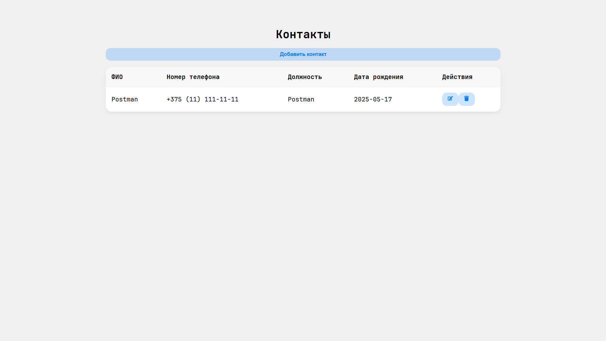
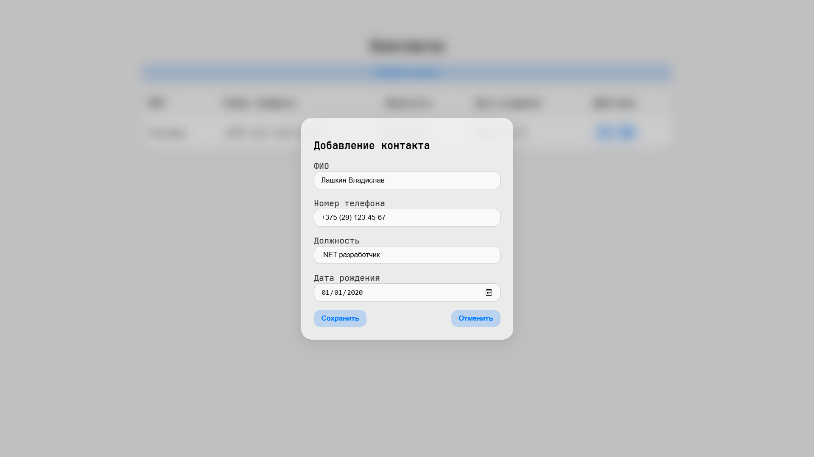
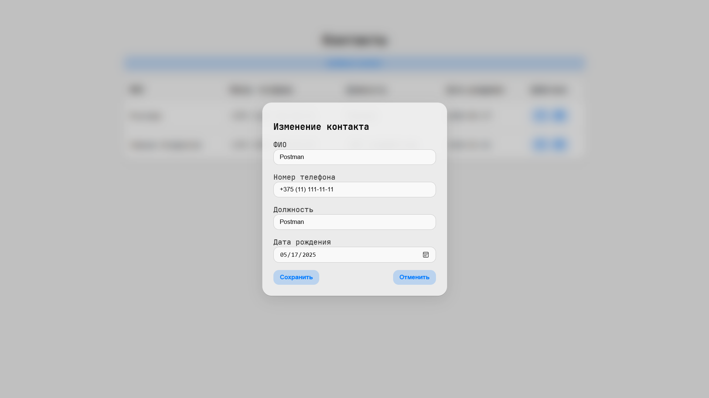
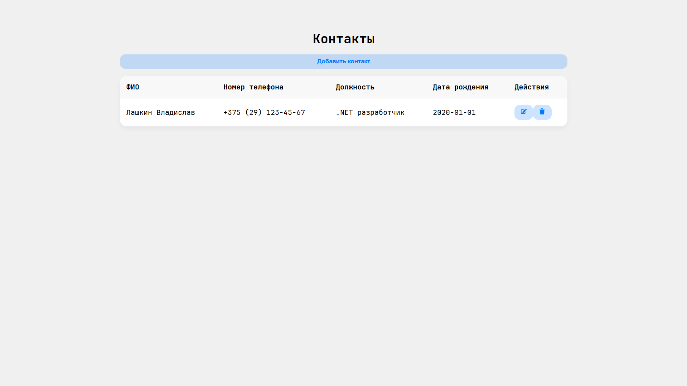

# Список контактов
## Что сделать, чтобы запустить?
### **0. Скачать git и docker**
Для клонирования, сборки и запуска приложения необходимо установить [git](https://git-scm.com/downloads/win) и [docker](https://docs.docker.com/desktop/setup/install/windows-install).
### **1. Клонировать этот репозиторий**
```shell
git clone https://github.com/vlados1kin/phone-book
```
### **2. Перейти в директорию**
```shell
cd link-shortener/docker
```
### **3. Поднять Docker-контейнеры**
```shell
docker-compose up --build -d
```
API будет доступно по адресу: [http://localhost:8080](http://localhost:8080)<br>
Главная страница с контактами: [http://localhost:3000](http://localhost:3000)<br>

## Конечные точки API
| Метод  | Путь               | Описание                 |
|--------|--------------------|--------------------------|
| GET    | /api/contacts      | Получение всех контактов |
| GET    | /api/contacts/{id} | Получение контакта по id |
| POST   | /api/contacts      | Создание контакта        |
| PUT    | /api/contacts/{id} | Изменение контакта по id |
| DELETE | /api/contacts/{id} | Удаление контакта по id  |

## Скриншоты



